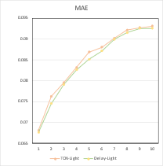

# DelayNet: Enhancing temporal feature extraction for electronic consumption forecasting with delayed dilated convolution

This is the origin Tensorflow implementation of DelayNet in the following paper: https://www.mdpi.com/1996-1073/16/22/7662

<table border="0">
 <tr>
    <td style="width: 30%; vertical-align: top">
         <br>
        <b>Figure 1.</b> The overall DelayNet architecture.
    </td>
    <td>
        <br>
        <b>Figure 2.</b> The detail of DelayNet architecture.
    </td>
 </tr>
</table>


# Initialized environment (Linux OS)

```shell
# using Conda
conda env create -f environment.yaml  # Check the name of environment before import
conda activate ts_model
conda install -c conda-forge cudatoolkit=11.8.0
pip install nvidia-cudnn-cu11==8.6.0.163
CUDNN_PATH=$(dirname $(python -c "import nvidia.cudnn;print(nvidia.cudnn.__file__)"))
export LD_LIBRARY_PATH=$LD_LIBRARY_PATH:$CONDA_PREFIX/lib/:$CUDNN_PATH/lib
mkdir -p $CONDA_PREFIX/etc/conda/activate.d
echo 'CUDNN_PATH=$(dirname $(python -c "import nvidia.cudnn;print(nvidia.cudnn.__file__)"))' >> $CONDA_PREFIX/etc/conda/activate.d/env_vars.sh
echo 'export LD_LIBRARY_PATH=$LD_LIBRARY_PATH:$CONDA_PREFIX/lib/:$CUDNN_PATH/lib' >> $CONDA_PREFIX/etc/conda/activate.d/env_vars.sh

```

# Requirements

Dependencies can be installed using the following command:

```shell
pip install -r requirements.txt
`````

### Notice:

We are using TensorFlowV2.11 in order to use Keras-TCN library. So, there are some expected issues installation.

# Datasets

In this paper, we experimented on 4 datasets

| Dataset  | Length | No. Variables | Attributions                                                                                                       |
|----------|--------|---------------|--------------------------------------------------------------------------------------------------------------------|
| [France Household energy consumption](https://paperswithcode.com/dataset/electricity)   | 34,589 | 7             | Global active power, Global reactive power, Voltage, Global intensity, Submetering-1, Submetering-2, Submetering-3 |
| [Spain-household](https://paperswithcode.com/dataset/energy-consumption-curves-of-499-customers)    | 8,760  | 2             | Energy consumption, Outside temperature                                                                            |
| [CNU](https://github.com/andrewlee1807/CNU-Dataset)      | 11,209 | 2             | Energy consumption, Outside temperature                                                                            |
| Gyeonggi | 17,001 | 1             | Energy consumption                                                                                                 |

The **Gyeonggi** dataset used in the paper can be downloaded in the Hugging Face repo [GyDataset](https://huggingface.co/datasets/andrewlee1807/Gyeonggi). Note that the input of each dataset is zero-mean normalized in this implementation.  


<table border="0">
 <tr>
    <td style="width: 40%; vertical-align: top">
        Gyeonggi dataset is 10,000 households based on the highest meter reading rate for all branches of the around in Gyeonggi Province, South Korea. For privacy reasons, the name of the household is not provided. We only provide the ID of the household. It en-compasses hourly records of building power consumption spanning approximately 1.9 years, ranging from January 1, 2021, to January 14, 2022.
    </td>
    <td>
        
    </td>
 </tr>
</table>

#### An example of the Gyeonggi data
| electrical-meter-id | date     | hour | customer-id | amount-of-consumption |
|---------------------|----------|------|-------------|-----------------------|
| 7871                | 20201020 | 1    | 7871        | 4.25                  |
| 7871                | 20201020 | 2    | 7871        | 4.12                  |
| 7871                | 20201020 | 3    | 7871        | 4.08                  |
| 7871                | 20201020 | 4    | 7871        | 4.03                  |
| 7871                | 20201020 | 5    | 7871        | 4.09                  |

#### Our experiment focuses on the total electricity consumption of a particular ID 6499

# Reproducibility

Besides, the experiment parameters of each data set are formated in the `.sh` files in the directory `./scripts/`. You can refer to these parameters for experiments, and you can also adjust the parameters to obtain better mse and mae results or draw better prediction figures.

- (Optional) Set Linux Commands to Run in the Background Using disown:
    ```shell
    tmux new -d 'sh execute_model1_spain.sh > output.log'
    ```

# Usage
- Commands for training and testing the DelayNet on Gy dataset:
```shell
python main.py
    --dataset_name="GYEONGGI9654"
    --output_dir="benchmark/exp/gy/delay1"
    --config_path="benchmark/config/gy/gyeonggi_9654_delay1.yaml"
    --output_length=1
    --device=0
    --features="amount-of-consumption"
    --prediction_feature="amount-of-consumption"
```


We provide ability to custom the DelayNet model to fit different purposes. Here is the example of `gyeonggi_delay1.yaml` file configuration for Gyeonggi data.
```yaml
#INITIAL SETTINGS
kernel_size: 12
gap: 24       # distance kernal mask
delay_factor: 3 # how many kernal mask refer to the past
nb_filters: 16  # Number of filters 
nb_stacks: 2 # Number of Delayed block, minimum=1
input_width: 168
train_ratio: 0.9 # Train and Test dataset (in this case: 90% using for Train and 10% for Testing)
epochs: 10
optimizer: "adam"
metrics: [ 'mse', 'mae' ]
```
- Commands for training and testing the model with any time series data:
```shell
python main.py 
    --write_log_file=<True/False> 
    --dataset_path="dataset/example.csv"
    --config_path="dataset/example.yaml" 
    --output_length=1 
    --device=0 
    --output_dir="benchmark/exp/delay"
    --features="feature1,feature2"
    --prediction_feature="feature1"
```
    Note: `example.yaml` config file need provided to custom DelayNet Model.


- The detailed descriptions about the arguments are as following:


# Results
We have updated the experiment results on 4 datasets and compared our DelayNet model to other methods.

<table border="0">
 <tr>
    <td style="width: 50%; vertical-align: top">
        
        <br>
        <b>Figure 3.</b> Number of parameters comparison.
    </td>
    <td>
        <br>
        <b>Figure 4.</b> MSE and Time Executed of our DelayNet compared with TCN.
    </td>
 </tr>
</table>

**Light-DelayNet performance compared with Light-TCN** 
<table border="0">
 <tr>
    <td style="width: 25%; vertical-align: top">
        
        <br>
        <b>a)	Gyeonggi</b>
    </td>
    <td style="width: 25%; vertical-align: top">
        <br>
        <b>b)	France</b>
    </td>
    <td style="width: 25%; vertical-align: top">
        
        <br>
        <b>c)	CNU</b>
    </td>
    <td style="width: 25%; vertical-align: top">
        <br>
        <b>d)	Spain</b>
    </td>
 </tr>
</table>

| Methods | DelayNet | DelayNet | LSTM   | LSTM | MLP    | MLP | GRU    | GRU | TCN-2layers | TCN-2layers | ARIMA  | ARIMA | StrideTCN | StrideTCN |
|---------|----------|---------|--------|---------|--------|---------|--------|---------|-------------|----------|--------|----------|---------------|----------|
| Metric| MSE      | MAE     | MSE    | MAE     | MSE    | MAE     | MSE    | MAE     | MSE         | MAE      | MSE    | MAE      | MSE           | MAE      |
| 1       | 0.0018   | 0.0172  | 0.0021 | 0.0199  | 0.0026 | 0.0243  | 0.0020 | 0.0195  | 0.0019      | 0.0199   | 0.0023 | 0.0161   | 0.0058        | 0.0351   |
| 5       | 0.0045   | 0.0280  | 0.0050 | 0.0311  | 0.0049 | 0.0334  | 0.0051 | 0.0321  | 0.0049      | 0.0314   | 0.0078 | 0.0337   | 0.0071        | 0.0435   |
| 10       | 0.0050   | 0.0308  | 0.0060 | 0.0351  | 0.0056 | 0.0348  | 0.0062 | 0.0362  | 0.0055      | 0.0344   | 0.0119 | 0.0465   | 0.0069        | 0.0397   |
| 15       | 0.0050   | 0.0308  | 0.0073 | 0.0401  | 0.0059 | 0.0363  | 0.0067 | 0.0379  | 0.0058      | 0.0362   | 0.0137 | 0.0523   | 0.0063        | 0.0373   |
| 20       | 0.0056   | 0.0329  | 0.0071 | 0.0403  | 0.0060 | 0.0365  | 0.0068 | 0.0380  | 0.0062      | 0.0381   | 0.0141 | 0.0534   | 0.0074        | 0.0422   |
| 24       | 0.0055   | 0.0362  | 0.0063 | 0.0377  | 0.0061 | 0.0372  | 0.0071 | 0.0387  | 0.0064      | 0.0387   | 0.0136 | 0.0516   | 0.0066        | 0.0390   |
| 36       | 0.0058   | 0.0385  | 0.0076 | 0.0433  | 0.0062 | 0.0392  | 0.0073 | 0.0414  | 0.0063      | 0.0399   | 0.0140 | 0.0531   | 0.0076        | 0.0434   |
| 48       | 0.0068   | 0.0386  | 0.0062 | 0.0391  | 0.0063 | 0.0396  | 0.0074 | 0.0424  | 0.0063      | 0.0406   | 0.0143 | 0.0543   | 0.0074        | 0.0456   |
| 60       | 0.0061   | 0.0392  | 0.0065 | 0.0408  | 0.0062 | 0.0397  | 0.0064 | 0.0422  | 0.0065      | 0.0416   | 0.0147 | 0.0556   | 0.0081        | 0.0459   |
| 84      | 0.0059   | 0.0393  | 0.0063 | 0.0396  | 0.0063 | 0.0417  | 0.0069 | 0.0435  | 0.0064      | 0.0408   | 0.0149 | 0.0569   | 0.0077        | 0.0487   |
| 96      | 0.0064   | 0.0410  | 0.0060 | 0.0375  | 0.0064 | 0.0437  | 0.0068 | 0.0448  | 0.0065      | 0.0424   | 0.0151 | 0.0575   | 0.0067        | 0.0424   |
| 132      | 0.0064   | 0.0417  | 0.0066 | 0.0399  | 0.0065 | 0.0442  | 0.0067 | 0.0424  | 0.0064      | 0.0426   | 0.0156 | 0.0591   | 0.0065        | 0.0399   |
| 144      | 0.0063   | 0.0418  | 0.0066 | 0.0403  | 0.0064 | 0.0428  | 0.0070 | 0.0433  | 0.0063      | 0.0421   | 0.0156 | 0.0593   | 0.0080        | 0.0459   |
|         |          |         |        |         |        |         |        |         |             |          |        |          |               |          |
| Better (in average)  | 0        | 0       | 10.28% | 6.22%   | 7.00%  | 8.47%   | 13.45% | 9.57%   | 5.81%       | 7.22%    | 54.73% | 27.51%   | 23.22%        | 17.23%   |


# Citation

```
@inproceedings{anhle-delaynet-2023,
  author    = {Le Hoang Anh, Dang Thanh Vu, Yu Gwanghuyn, Kim Jin Young},
  title     = {DelayNet: Enhancing temporal feature extraction for electronic consumption forecasting with delayed dilated convolution},
  booktitle = {},
  volume    = {},
  number    = {},
  pages     = {},
  publisher = {{} Press},
  year      = {2023},
}
```